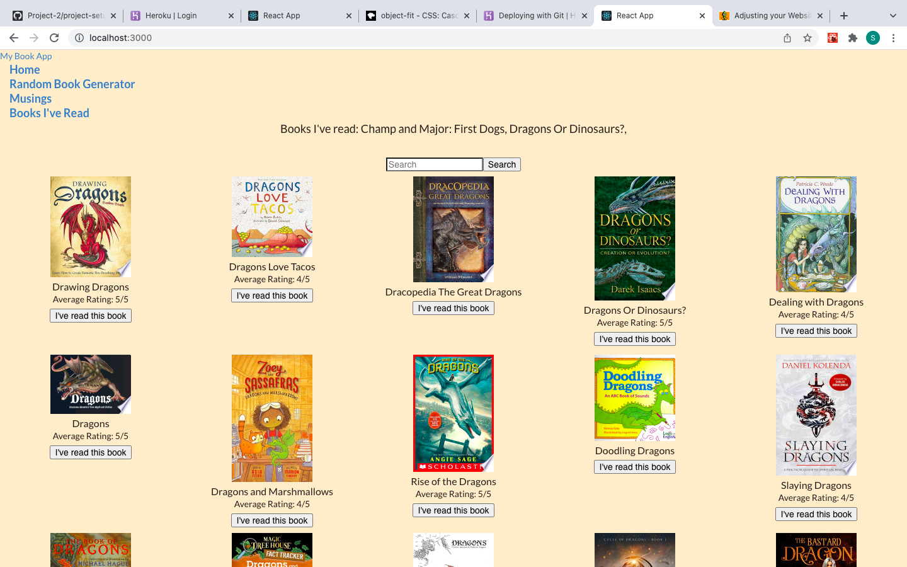
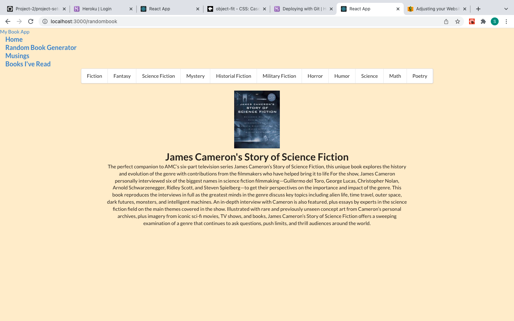
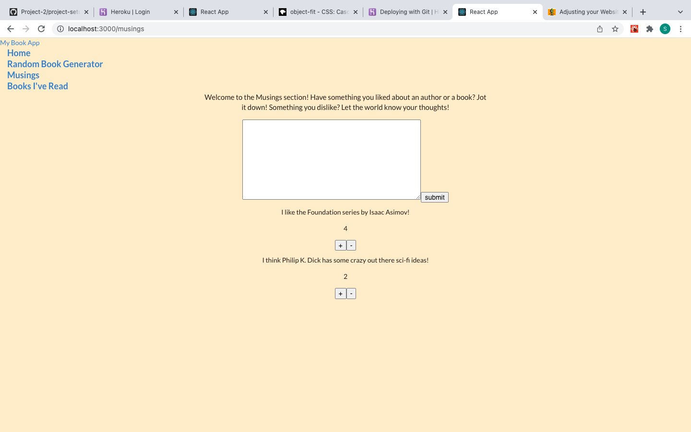
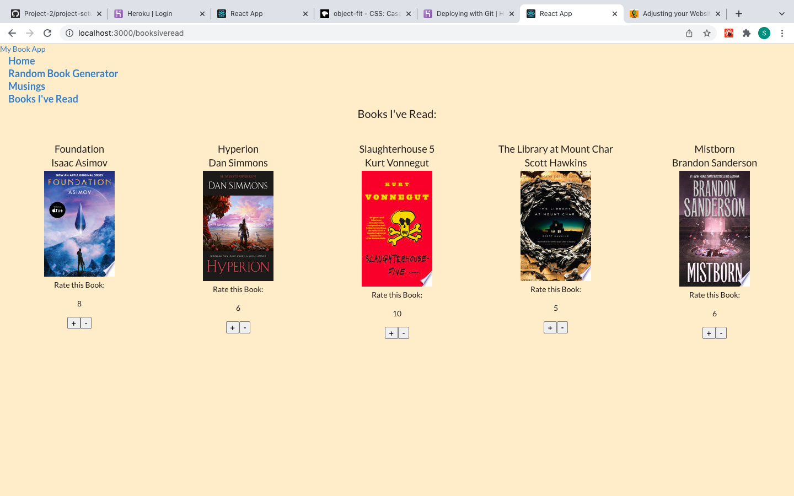

# Book App
In the project I created an app that will allow users to search for books they like, then log the books they have read at the top of the screen. I also included a "musings" section for people to leave comments about books or authors that they like or dislike, with a ratings system for people to upvote or downvote comments they like or dislike. I have a random book generator that allows you to get a random book based on a number of different genres. Finally, I have a page that will be the area where the user can display the books they've selected as having read. It includes upvote/downvote buttons as well. This page is unfinished, so for now I just have some books I've read coded into the page to show how it will look.

### Website
https://bookappscottmacleod.herokuapp.com/

### Technologies used
- HTML
- Javascript
- CSS
- React

### Challenges Overcome
- Using ```useEffect``` to make the "previous" and "next" buttons in my search results section work
- Using ```Object.keys().includes()``` with a ternary operator to tell whether or not I had to use a "No Image Found" picture
- Passing functions and variables between components
- Adding to the arrays using ```setState()```

### Enjoy



